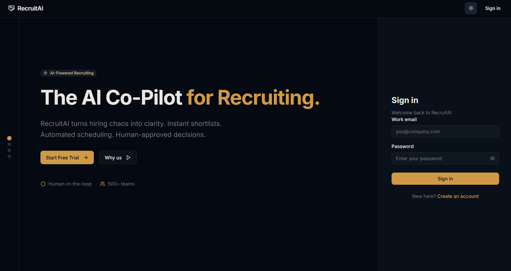
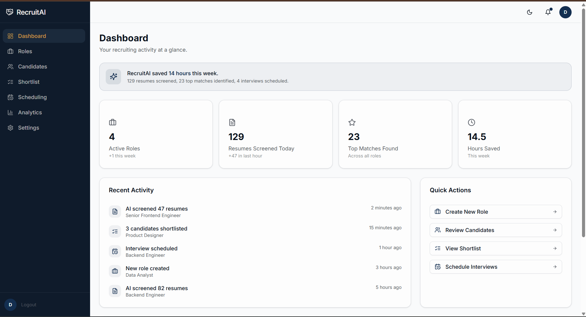
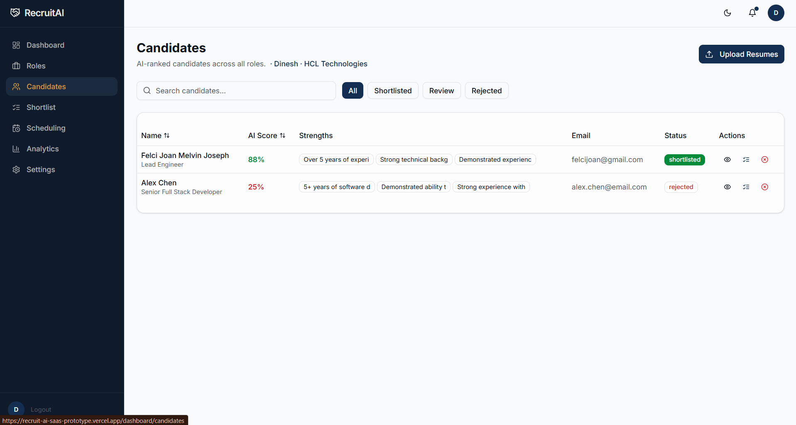
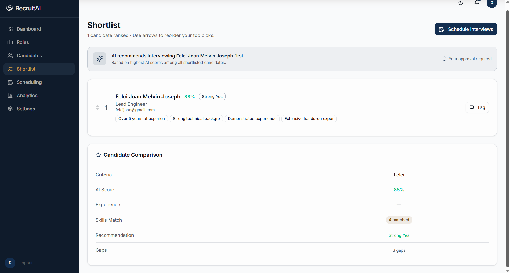
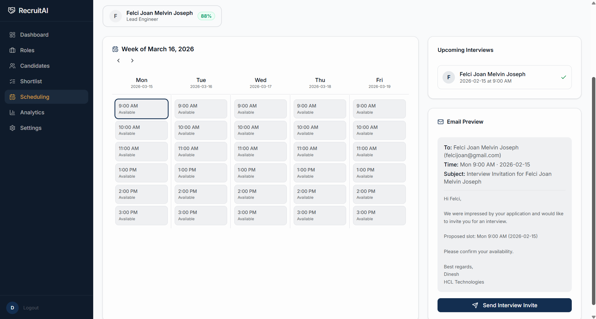

# Recruit-AI
“Not just a project — an AI-powered vision for the future of recruitment.”

Presenting: RecruitAI – your AI-powered hiring co-pilot.
✨ “From JD creation to final offer – automate it all with intelligence.”

Crafted with passion & purpose by:
Felci Joan

## Overview

Recruit-AI is an agentic AI-powered recruiting tool designed to address inefficiencies in the hiring market for small to mid-sized companies. These organizations often receive hundreds of resumes for open roles but lack dedicated HR staff to screen them effectively, leading to decision fatigue, slow time-to-hire, and poor candidate experiences.

### Target User
"Sarah," a Talent Acquisition Manager or Founder at a 50-person tech company. She is overwhelmed by administrative tasks and fears missing out on great talent due to being buried in PDFs.

### The Problem
High-volume screening results in decision fatigue, prolonged hiring timelines, and suboptimal candidate experiences.

### The Solution
An agentic AI solution that automates the "Screening & Scheduling" phase of recruitment.

### 💥 Why Agentic AI?

Hiring today is still stuck in the past:

✖️ Endless resume screening
✖️ Back-and-forth scheduling
✖️ Candidate disengagement

So reimagined the process – with AI at its core.
And the results? Game-changing.

🎯 Key Features
- **Automated Resume Screening**: AI parses and analyzes resumes against job descriptions.
- **Candidate Ranking and Shortlisting**: Intelligent scoring and prioritization of candidates.
- **Interview Scheduling**: Automated scheduling and email invites for shortlisted candidates.
- **Dashboard Management**: User-friendly interface for managing candidates, roles, scheduling, and analytics.
- **Integration with n8n**: Leverages n8n for AI processing workflows.

Screeshots:
Landing Page:

Dashboard :

Candidates:

Shortlist :

Scheduling:


## Tech Stack
- **Frontend**: Next.js 15, React 19, Tailwind CSS
- **Backend**: Next.js API Routes, Supabase (database and authentication)
- **AI Processing**: n8n for agentic AI workflows
- **Other**: TypeScript, ESLint, Prettier

## Installation

1. Clone the repository:
   ```bash
   git clone <repository-url>
   cd recruit-ai-saa-s-prototype
   ```

2. Install dependencies:
   ```bash
   npm install
   # or
   pnpm install
   ```

3. Set up environment variables. Create a `.env.local` file in the root directory with the following:
   ```
   NEXT_PUBLIC_SUPABASE_URL=your_supabase_url
   NEXT_PUBLIC_SUPABASE_ANON_KEY=your_supabase_anon_key
   N8N_WEBHOOK_URL=your_n8n_webhook_url
   # Add other required variables as per your setup
   ```

4. Run the development server:
   ```bash
   npm run dev
   # or
   pnpm dev
   ```

5. Open [http://localhost:3000](http://localhost:3000) in your browser.

## Project Structure
- `app/`: Next.js app directory
  - `dashboard/`: Dashboard pages (candidates, roles, scheduling, analytics)
  - `api/`: API routes (e.g., score for AI processing)
- `components/`: Reusable React components
- `lib/`: Utility functions and configurations
- `public/`: Static assets

## API Routes
- `POST /api/score`: Processes job descriptions and resumes, forwards to n8n for AI analysis, and saves results to Supabase.

## Scripts
- `npm run dev`: Start development server
- `npm run build`: Build for production
- `npm run start`: Start production server
- `npm run lint`: Run ESLint

## Contributing
1. Fork the repository.
2. Create a feature branch.
3. Make your changes and commit.
4. Push to your branch and create a pull request.

## License
This project is licensed under the MIT License.
